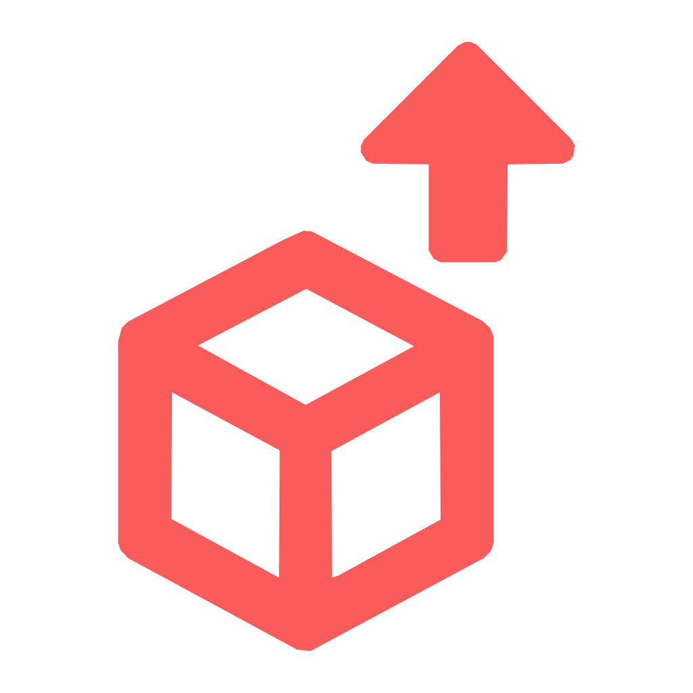
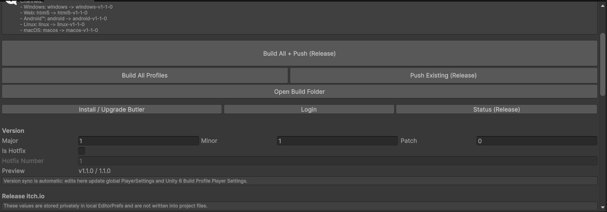

# Easy Itch Push

  

Local Unity Editor plugin for building the project and publishing builds to itch.io with Butler.

## Install
- Unity Package Manager: `https://github.com/NnicanBuak/unity-easy-itch-push.git`
- In Unity open `Window > Package Manager > + > Add package from git URL...` and paste that URL.

## Screenshot

## Setup
- Open `Project Settings > Easy Itch Push`.
- Choose a `Push Mode` at the top: `Release` or `Test`.
- Set required publishing fields for both targets: `Release Username/Game Slug/Project ID`, `Test Username/Game Slug/Project ID`, and version fields.
- Click `Ensure Windows/Web Profiles`.
- Click `Tools > Easy Itch Push > Install or Upgrade Butler`.
- Click `Tools > Easy Itch Push > Login to itch.io`.

## Build Profiles
- `Windows` builds to `Builds/windows/latest/LD59.exe`.
- `Web` builds to `Builds/html5/latest/`.
- Other profiles build to `Builds/<base-channel>/latest/`.
- Base channels control local output folders and `Test` push channels.
- `Release` pushes resolve remote channels automatically as `<base-channel>-v<major>-<minor>-<patch>`.
- Push uploads only zip archives from the platform folder, never the `latest` folder directly.
- `Builds/` is ignored by git.

## Versioning
- The plugin writes the selected version to `PlayerSettings.bundleVersion`.
- Version edits in the plugin window also update Unity 6 `Build Profiles` automatically.
- Version edits are saved immediately so the configured version does not lag behind Player Settings.
- Android version code uses `Major * 10000 + Minor * 100 + Patch + HotfixNumber`.
- Butler uploads use the same version through `--userversion`.
- On install, Easy Itch Push creates `Assets/CHANGELOG.md` automatically if it does not exist yet.
- Every successful profile build creates a versioned zip archive in the platform folder, for example `Builds/windows/LD59-Windows-v1.0.0.zip`.
- `Assets/CHANGELOG.md` is the only changelog source. Keep all versions there as `## v<version>` sections.
- The plugin window includes a changelog editor for the current version and writes that text back into the matching section in `Assets/CHANGELOG.md`.
- Every generated build gets its own `CHANGELOG.md` containing only the current version section cut from `Assets/CHANGELOG.md`.
- `Update Existing Build Changelogs` injects the current version changelog into already built current-version archives and matching `latest` build folders without rebuilding.
- During `butler push`, Easy Itch Push uploads the original versioned archive so the itch download name preserves the full release or hotfix version.

## Release Builds
- `Build All Profiles and Push` disables development/debug build options before building.
- Platform Player Settings such as scripting backend, managed stripping, and Strip Engine Code come from each Unity Build Profile.
- The plugin does not override platform-specific Player Settings during builds.

## Push Validation
- Push commands are blocked until `Username`, `Game Slug`, `Project ID`, channel, and version are filled.
- Every push validates all Build Profile archives before Butler runs.
- All platform archives must exist in their platform folders and must end with the configured version, for example `-v1.0.0.zip`.
- All platform archive versions must match each other and the configured plugin version.
- HTML5 uploads are blocked unless the zip archive contains `index.html` at the archive root.
- The plugin does not push partial releases. If one platform is missing or invalid, no channel is uploaded.

## Logs
- Plugin output is written to the Unity Console and to daily files under `logs/EasyItchPush/`.
- File logs are ignored by git and survive Unity Console clears during build target/profile switches.

## Use
- Manual review path: run `Build All Profiles`, check the generated archives, optionally run `Update Existing Build Changelogs` after changelog edits, then run `Push Existing Builds`.
- Full automation path: run `Build All Profiles and Push`.
- `Build All Profiles and Push` uses the currently selected `Release` or `Test` mode, always builds all profiles as **release** builds, validates every generated zip archive, then uploads all matching remote itch channels.
- `Push Existing Builds` uses the currently selected mode, updates changelogs in existing current-version archives, and reuses those local zip archives without rebuilding.
